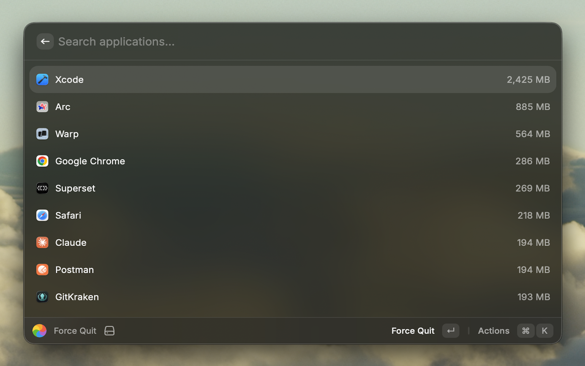

# Force Quit

Force quit running applications and processes from Raycast — like macOS' ⌥⌘⎋, but without leaving your keyboard.



## Install (from source)

Not on the Raycast Store — install it as a local extension. You run the dev server **once**; it registers the extension into Raycast and it stays installed after you stop it.

```sh
git clone https://github.com/2dubu/raycast-force-quit.git
cd raycast-force-quit
npm install
npm run dev   # ray develop
```

Once the terminal prints `built extension successfully` and the **Force Quit** command shows up in Raycast, press `Ctrl+C` to stop the dev server. The extension stays installed and works without it — re-run `npm run dev` only when you want to rebuild after changing the code.

Requires [Raycast](https://raycast.com) and Node.js.

## Commands

### Force Quit
List running applications sorted by memory usage. Select an app and press Enter to force quit it after a confirmation prompt.

### Force Quit Process
Same flow, but lists *every* process on the system (background daemons included). Useful when an app is unresponsive but doesn't appear in the standard list.

## Behavior

- Selecting an item shows a confirm dialog. Confirming sends `SIGKILL` immediately — equivalent to macOS' built-in Force Quit.
- A HUD message confirms success or failure.
- `⌘R` refreshes the list manually. The list does not auto-poll.

## Permissions

Force Quit only reads the public macOS process list (`lsappinfo`, `ps`) — no Automation permission, Accessibility permission, or full‑disk access is required.
